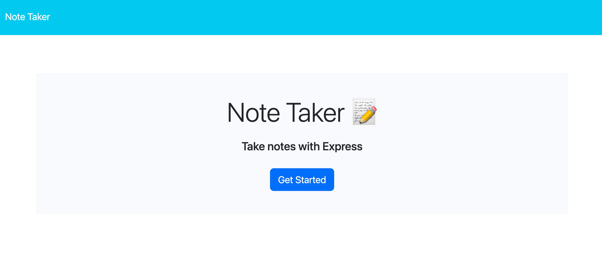
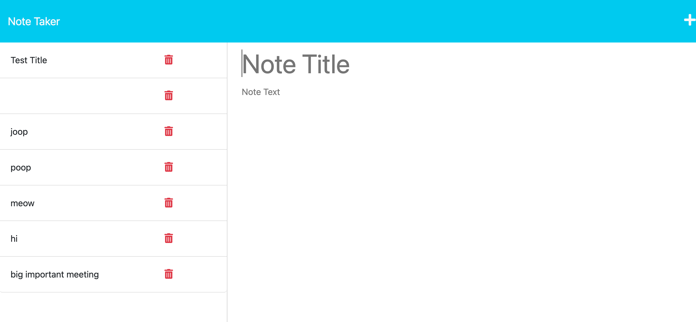

# <Note-Taker>

## Description

This project was built to allow the user to write and save notes, so that they can easily organize their thoughts & keep track of tasks they need to complete.

## Installation

Clone repository and install needed packages.

## Usage

1. To begin, click the get started button.
2. When you are taken to the notes page, you can type your note in the text placeholders.
3. Click the save button in the top right corner to save your note.
4. You can click on your note to open it.
5. Click the plus sign button in the top right corner to add a new note.

## License

This application is covered by the MIT license
